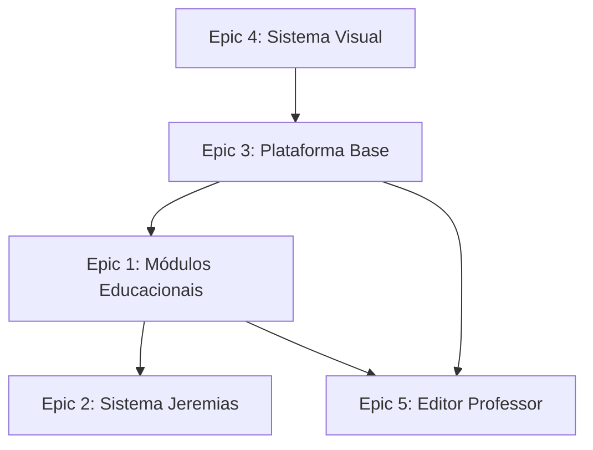

# Épicos - Dimidui MVP

Este diretório contém os épicos organizacionais para o desenvolvimento do Dimidui, uma plataforma educacional para prática supervisionada em matemática e português.

## Visão Geral dos Épicos

### [Epic 1: Sistema de Módulos Educacionais](./epic-1-modulos-educacionais.md)
**Prioridade:** Must Have | **Estimativa:** 3 semanas
Implementa a biblioteca de módulos reutilizáveis que formam o core das atividades educacionais.

**Módulos incluídos:** M1 (BateriaRápida), M5 (IdentificaOperação), M14 (AutoAvaliação)

### [Epic 2: Sistema do Personagem Jeremias](./epic-2-sistema-jeremias.md)
**Prioridade:** Must Have | **Estimativa:** 2 semanas
Cria o personagem virtual que comete erros conceituais para ativar a técnica Feynman.

**Módulos incluídos:** M10 (JeremiasResolver), M20 (EstadoJeremias)

### [Epic 3: Plataforma Base e Dashboard](./epic-3-plataforma-base.md)
**Prioridade:** Must Have | **Estimativa:** 2 semanas
Estabelece infraestrutura base com autenticação, dashboards e gestão de progresso.

### [Epic 4: Sistema Visual e Experiência](./epic-4-sistema-visual.md)
**Prioridade:** Must Have | **Estimativa:** 1.5 semanas
Implementa identidade visual e princípios de design para experiência respeitosa e acessível.

### [Epic 5: Editor de Atividades (Professor)](./epic-5-editor-professor.md)
**Prioridade:** Should Have | **Estimativa:** 2 semanas
Ferramentas para professores criarem atividades combinando módulos.

## Cronograma de Desenvolvimento

```
FASE 1 (Semanas 1-2): Fundação
├─ Epic 4: Sistema Visual (1.5 sem)
├─ Epic 3: Plataforma Base (2 sem)
└─ Setup: Vite + React + Tailwind + Supabase

FASE 2 (Semanas 3-5): Core Pedagógico
├─ Epic 1: Módulos Educacionais (3 sem)
└─ Testes com usuários reais

FASE 3 (Semanas 6-7): Diferencial
├─ Epic 2: Sistema Jeremias (2 sem)
└─ Integração e testes

FASE 4 (Semanas 8-10): Autonomia
├─ Epic 5: Editor Professor (2 sem)
└─ Polimento e deploy
```

## Dependências Entre Épicos



## Métricas de Sucesso por Epic

### Epic 1: Módulos Educacionais
- [ ] 100% dos módulos MVP funcionais
- [ ] <2s carregamento de qualquer módulo
- [ ] 90%+ taxa de conclusão das atividades
- [ ] Zero perda de dados de progresso

### Epic 2: Sistema Jeremias
- [ ] >80% estudantes completam interação
- [ ] >70% identificam erro corretamente
- [ ] <5% feedback negativo sobre personagem
- [ ] Estado persiste entre sessões

### Epic 3: Plataforma Base
- [ ] Login independente >90% alunos
- [ ] Dashboard carrega <3s
- [ ] Zero perda de dados
- [ ] Suporte 30 usuários simultâneos

### Epic 4: Sistema Visual
- [ ] WCAG AA compliance
- [ ] 60fps animações em desktop
- [ ] Fontes carregam <1s
- [ ] Temas funcionam corretamente

### Epic 5: Editor Professor
- [ ] Atividade criada <10min
- [ ] >80% professores usam semanalmente
- [ ] Zero erros na configuração
- [ ] Dashboard útil reportado

## Riscos Principais

| Épico | Risco Principal | Probabilidade | Mitigação |
|-------|----------------|---------------|-----------|
| Epic 1 | Complexidade modular | Média | Prototipagem, validação professor |
| Epic 2 | Jeremias irritante | Média | Testes usuário, linguagem respeitosa |
| Epic 3 | Performance Supabase | Baixa | Testes carga, otimização queries |
| Epic 4 | Acessibilidade complexa | Baixa | Auditoria especializada |
| Epic 5 | Interface professor complexa | Alta | Design participativo, simplicidade |

## Definição de Pronto (Epic Level)

Para considerar um épico completo:

- [ ] Todas as user stories implementadas e testadas
- [ ] Métricas de sucesso atingidas
- [ ] Documentação técnica completa
- [ ] Testes automatizados funcionais
- [ ] Revisão de código aprovada
- [ ] Teste de usabilidade com público-alvo
- [ ] Performance validada em ambiente real
- [ ] Integração com outros épicos verificada

## Stack Tecnológica

```javascript
{
  frontend: {
    framework: "React 18",
    styling: "Tailwind CSS 3.x",
    animations: "Framer Motion",
    routing: "React Router 6"
  },
  backend: {
    platform: "Supabase",
    database: "PostgreSQL 14+",
    auth: "Supabase Auth",
    realtime: "Supabase Realtime"
  },
  development: {
    bundler: "Vite",
    linter: "ESLint",
    formatter: "Prettier"
  },
  deployment: {
    hosting: "Vercel",
    ci_cd: "GitHub Actions"
  }
}
```

## Próximos Passos

1. **Refinamento técnico** com equipe de desenvolvimento
2. **Setup de ambiente** de desenvolvimento e CI/CD
3. **Criação de backlog** detalhado por sprint
4. **Preparação de conteúdo** educacional
5. **Início da Fase 1** (Epic 4 + Epic 3)